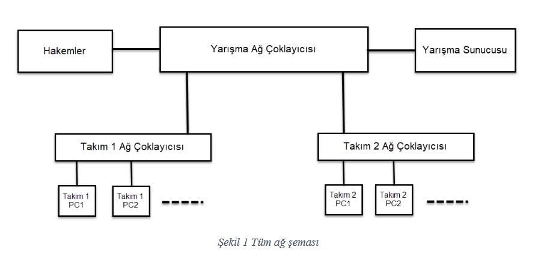
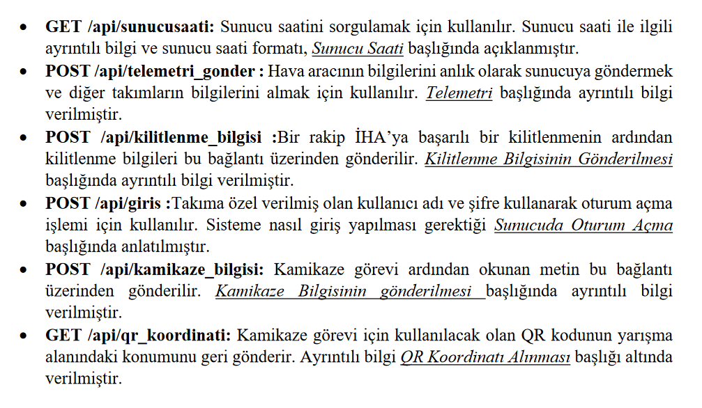
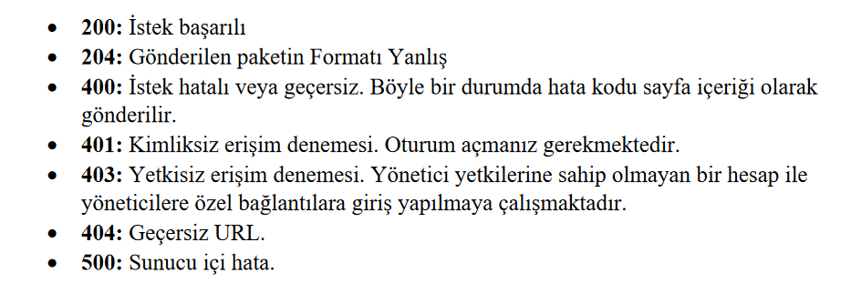

<h1 align="center">
  Teknofest IHA Haberleşme Modülü
</h1>

## İçerik
 - [Hakkında](#hakkında)
 - [Teknofest Haberleşme Dökümanı](#teknofest-haberleşme-dökümanı)
 - [Modülün Yapısı](#modülün-yapısı)
 - [Deneme Sunucusu](#deneme-sunucusu)
 - [Entegrasyon](#entegrasyon)
 - [Eklenecekler](#eklenecekler)

## Hakkında
Bu modül, Teknofest 2024 Savaşan IHA Yarışmasında yarışma sunucusu ile haberleşmeyi sağlar. Yarışma sunucusunun sağladığı API'a uygun hazırlanmış localhost ile çalışan NodeJS sunucusu ile bağlantı kurar. Python 3.10.6 versiyonunda yazılmıştır.

## Teknofest Haberleşme Dökümanı

<p align="center">
  
  
  Yukarıdaki şemada da görüldüğü üzere takımlar yarışma sunucusuna sadece bir ip adresi üzerinden bağlanabilir. Takımların, yarışma sunucusundan aldıkları veriyi diğer takım içi cihazlara kendi yerel sunucuları ile dağıtmaları gerekir.
</p>

<p align="center">
  

  Yukarıdaki resimde yarışma sunucusuna ait API görülmektedir. Takımlar bu API ile yarışma sunucusuyla bağlantı kurabilirler. Yarışma sunucusu ile bağlantı kurma aşamasında dikkat edilmesi gereken birtakım kriterler vardır.
  - Takımlar herhangi bir işlem yapmadan önce oturum açmalıdır.
  - Takımların saniyede en az 1, en fazla 2 kere telemetri verisini yarışma sunucusuna göndermeleri gerekmektedir.
  - Takımların diğer takım içi cihazları sunucu saatine göre ayarlaması önerilir.
</p>

<p align="center">
  

  Yukarıdaki resimde yarışma sunucusundan gelebilecek durum kodları yer almaktadır.
  - Yapılan istek başarılı olursa 200 ile cevaplanır.
  - Oturum açmadan yapılan istekler 401 ile cevaplanır.
  - Oturum açarken Kullanıcı adı veya şifrenin hatalı olması 400 ile cevaplanır.
  - Telemetri paketleri saniyede 2 defadan fazla gönderilirse 400 ile cevaplanır. Sayfa içerği 3 hata kodunu içerir.
</p>

Kullanılan görseller [Teknofest 2023 Haberleşme Dökümanından](https://cdn.teknofest.org/media/upload/userFormUpload/Savasan_IHA_Haberlesme_Dokumani_v6_Sxf7C.pdf) alınmıştır.

## Modülün Yapısı
Modülün ana faktörü Client class'ıdır. Client class'ına ait metodlar ile yarışma sunucusuyla bağlantı kurulabilir. Class sadece temel bağlantı fonksiyonlarını barındırır. Sunucudan alınan veriler get metodları ile elde edilebilir. Sunucuya yapılan istekler ise request veya send metodları ile yapılır. Herhangi bir send methodu kullanılmadan önce set methodu kullanılmalıdır.

Örnek olarak:

```python
from teamClient import Client

team = Client("takimkadi", "takimsifresi")

team.login()

team.set_telemetryInfo({ "telemetry": "json" })
team.sendTelemetryInfo()
```

## Deneme Sunucusu
Client class'ını test edebilmek için yapılmıştır. Sunucu için NodeJS, API için expressjs kullanılmıştır. Yarışma sunucusunun benzeridir, aynı API'ı sunar. Sunucuyu çalıştırmak için gerekli modüller yüklenmelidir. Modüllerin yüklenmesi için aşağıdaki terminal komutları kullanılabilir.

```bash
cd test_server
npm ci
```

Sunucuyu çalıştırmak için, aşağıdaki komutlar kullanılabilir.
```bash
cd test_server
node .
```
veya
```bash
cd test_server
node app.js
```
## Entegrasyon
teamClient.py dosyasının kopyalanıp projeye aktarılması yeterlidir. Ardından import edilebilir.

## Eklenecekler
 - Modülün başka bir sisteme kolayca entegre edilebilmesi için asenkron çalışması faydalı olabilir. Bu nedenle asenkron desteği eklenmelidir.
 - Asenkron desteği eklendikten sonra bir döngü içerisinde saniyede 1 kere telemetri verisi gönderilmelidir.
 - Test sunucusunda gerekli kontroller(paket içeriği, oturum açma...) yapılmamaktadır. Gerekli kontroller eklenmelidir.
